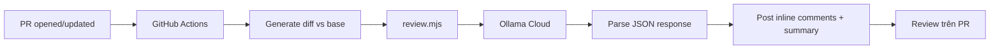

# Online Learning API

> RESTful API nền tảng học trực tuyến — Node.js, Express, SQL Server & PostgreSQL.

[](https://nodejs.org)
[](https://expressjs.com)
[](LICENSE)
[](CONTRIBUTING.md)
[](.github/workflows/ai-review.yml)

---

## 📑 Mục lục

- [Giới thiệu](#-giới-thiệu)
- [Tính năng](#-tính-năng)
- [Tech stack](#-tech-stack)
- [Cấu trúc thư mục](#-cấu-trúc-thư-mục)
- [Bắt đầu nhanh](#-bắt-đầu-nhanh)
- [Các API endpoint](#-các-api-endpoint)
- [Biến môi trường](#-biến-môi-trường)
- [AI Code Review](#-ai-code-review)
- [Đóng góp](#-đóng-góp)
- [Quy ước Git](#-quy-ước-git)
- [Tác giả & License](#-tác-giả--license)

---

## 🚀 Giới thiệu

`online-learning-api` là backend cho hệ thống học trực tuyến, cung cấp RESTful API phục vụ:

- Quản lý **khóa học**, **bài học**, **danh mục**
- **Đăng ký** học, **bookmark**, **đánh giá** khóa học
- **Quiz** & **câu hỏi**, lưu trữ **kết quả**
- **Hệ thống thông báo** (notifications)
- **Yêu cầu mentor**, **thống kê ứng dụng**
- **Xác thực JWT** + tích hợp **Firebase**

API được thiết kế theo kiến trúc **Routers → Controllers → Services** thuần Express 5, dễ mở rộng và bảo trì.

---

## ✨ Tính năng

| Module | Mô tả |
| --- | --- |
| 🔐 **Auth** | JWT, middleware phân quyền cho từng route |
| 📚 **Courses** | CRUD khóa học, danh mục, bài học, upload media |
| 🎓 **Enrollments** | Đăng ký, theo dõi tiến độ, danh sách học viên |
| 📝 **Quizzes** | Tạo bài kiểm tra, câu hỏi, chấm điểm tự động |
| 💬 **Reviews** | Đánh giá, bình luận khóa học |
| 🔖 **Bookmarks** | Lưu khóa học yêu thích |
| 🔔 **Notifications** | Hệ thống thông báo realtime cho user |
| 👨‍🏫 **Mentor Request** | Gửi & duyệt yêu cầu trở thành mentor |
| 📊 **App Stats** | Thống kê tổng quan ứng dụng |
| 🖼️ **File upload** | Multer hỗ trợ upload ảnh/video theo từng context |
| 🤖 **AI Review** | Tự động review code trên PR bằng Ollama Cloud |

---

## 🛠 Tech stack

**Runtime & Framework**
-  Node.js 24
-  Express 5

**Database**
-  PostgreSQL (pg)
-  Microsoft SQL Server (mssql)

**Auth & Cloud**
-  jsonwebtoken
-  firebase-admin (notifications + storage)

**Upload & API docs**
- `multer` — multipart/form-data
- `swagger-jsdoc` + `swagger-ui-express` — auto-generate docs

**DevOps**
- GitHub Actions (CI/CD + AI Review)
- Ollama Cloud (AI model)

---

## 📂 Cấu trúc thư mục

```
online-learning-api/
├── .github/
│   ├── workflows/
│   │   └── ai-review.yml         # Workflow AI review tự động
│   └── ai-review/
│       ├── review.mjs            # Script review (Node.js, ESM)
│       └── prompt.md             # System prompt cho Ollama
├── src/
│   ├── app.js                    # Express app + mount routers
│   ├── index.js                  # Server entry, listen port
│   ├── config/                   # DB, Firebase, Multer
│   ├── controllers/              # Business logic
│   ├── middleware/               # Auth, error handler, validate
│   ├── routes/                   # 13 routers
│   ├── services/                 # External service wrappers
│   └── public/                   # Static assets (uploads)
├── test-sql.js                   # SQL quick test
├── .env                          # Biến môi trường (không commit)
├── .gitignore
├── package.json
└── README.md
```

---

## ⚡ Bắt đầu nhanh

### 1. Clone & cài đặt

```bash
git clone https://github.com/Tranlong291003/online-learning-api.git
cd online-learning-api
npm install
```

### 2. Cấu hình `.env`

Tạo file `.env` ở thư mục gốc:

```env
# Server
PORT=3000

# SQL Server
SQL_SERVER=localhost
SQL_DATABASE=OnlineLearning
SQL_USER=sa
SQL_PASSWORD=your_password

# PostgreSQL
PG_HOST=localhost
PG_PORT=5432
PG_DATABASE=online_learning
PG_USER=postgres
PG_PASSWORD=your_password

# JWT
JWT_SECRET=your_super_secret_key
JWT_EXPIRES_IN=7d

# Firebase
FIREBASE_SERVICE_ACCOUNT_PATH=src/firebaseServiceAccountKey.json
```

### 3. Chạy server

```bash
npm start
```

Server lắng nghe tại `http://localhost:3000` (hoặc port trong `.env`).

API docs (Swagger UI) — nếu đã mount — tại `http://localhost:3000/api-docs`.

---

## 🔌 Các API endpoint

> Tổng: **13 router, 53+ endpoint** (xem chi tiết trong `src/routes/*.js`).

| Nhóm | Base URL | Router |
| --- | --- | --- |
| 🏷️ Course categories | `/api/course-categories` | `courseCategories.router.js` |
| 📚 Courses | `/api/courses` | `courses.router.js` |
| 📖 Lessons | `/api/lessons` | `lessons.router.js` |
| 🎓 Enrollments | `/api/enrollments` | `enrollments.router.js` |
| ❓ Quizzes | `/api/quizzes` | `quizzes.router.js` |
| ❓ Questions | `/api/questions` | `questions.router.js` |
| 📊 Quiz results | `/api/quiz-results` | `quizResults.router.js` |
| 👤 Users | `/api/users` | `user.router.js` |
| 🔔 Notifications | `/api/notifications` | `notifications.router.js` |
| ⭐ Reviews | `/api/reviews` | `reviews.router.js` |
| 🔖 Bookmarks | `/api/bookmarks` | `bookmarks.router.js` |
| 👨‍🏫 Mentor requests | `/api/mentor-requests` | `mentorRequest.router.js` |
| 📈 App stats | `/api/app-stats` | `appStats.router.js` |

### Ví dụ

```http
GET /api/courses
GET /api/courses/:id
POST /api/courses           # Auth, body: { title, description, category_id, ... }
PUT  /api/courses/:id       # Auth
DELETE /api/courses/:id     # Auth + role: admin
```

Hầu hết các route **POST/PUT/DELETE** yêu cầu header:

```http
Authorization: Bearer <jwt_token>
```

---

## 🔐 Biến môi trường

| Tên | Bắt buộc | Mô tả |
| --- | :---: | --- |
| `PORT` | ❌ | Port server (mặc định `3000`) |
| `SQL_*` | ✅ | Thông tin SQL Server |
| `PG_*` | ✅ | Thông tin PostgreSQL |
| `JWT_SECRET` | ✅ | Khóa bí mật ký JWT |
| `JWT_EXPIRES_IN` | ❌ | Thời hạn token (mặc định `7d`) |
| `FIREBASE_SERVICE_ACCOUNT_PATH` | ✅ | Đường dẫn tới Firebase service account JSON |

> ⚠️ **Không commit `.env`** vào git — đã có trong `.gitignore`.

---

## 🤖 AI Code Review

Mỗi Pull Request vào `main` / `master` / `develop` / `feature/**` sẽ **tự động** được review bởi **Ollama Cloud** (model `minimax-m3:cloud`).

### Cấu hình trên repo

Thêm **secret** trong `Settings → Secrets and variables → Actions`:

| Secret | Giá trị |
| --- | --- |
| `OLLAMA_API_KEY` | API key lấy từ [ollama.com](https://ollama.com) |

> (Tuỳ chọn) Thêm **variable** `OLLAMA_MODEL` để đổi model. Mặc định: `minimax-m3:cloud`.

### Quy trình



### Định dạng output

- **Summary**: banner trạng thái (✅/⚠️/⛔) + số comment theo severity + mục đích PR + danh sách file thay đổi.
- **Inline comment** trên từng dòng: **4 phần** — *Vấn đề → Bối cảnh → Hướng sửa → Ảnh hưởng* — kèm code suggestion hoàn chỉnh.

Chi tiết: xem [`.github/ai-review/`](.github/ai-review).

---

## 🤝 Đóng góp

1. Fork repo & tạo branch mới:

   ```bash
   git checkout develop
   git checkout -b feature/ten-tinh-nang
   ```

2. Commit theo [Conventional Commits](#-quy-ước-git):

   ```bash
   git commit -m "feat(courses): thêm API filter theo giá"
   ```

3. Push & tạo Pull Request vào `develop`.

4. Đợi **AI Code Review** + review từ maintainer.

5. Squash & merge sau khi được approve.

---

## 🌿 Quy ước Git

### Branch

| Branch | Mục đích |
| --- | --- |
| `main` | Production — bản stable, chỉ merge từ `develop` |
| `master` | Mirror của `main` (tương thích tooling cũ) |
| `develop` | Branch phát triển chính — default branch |
| `feature/*` | Tính năng mới |
| `fix/*` | Sửa bug |
| `refactor/*` | Tái cấu trúc không đổi behavior |
| `chore/*` | Việc vặt (deps, config) |
| `docs/*` | Tài liệu |

### Commit message (Conventional Commits)

```
<type>(<scope>): <mô tả ngắn>

- chi tiết 1
- chi tiết 2
```

**Type**: `feat`, `fix`, `refactor`, `perf`, `test`, `docs`, `chore`, `style`, `ci`.

**Ví dụ**:

```bash
feat(courses): thêm filter khóa học theo danh mục và giá
fix(auth): validate JWT expiry đúng cách
chore(deps): bump express lên 5.1.0
```

---

## 👨‍💻 Tác giả

- **Tranlong291003** — [github.com/Tranlong291003](https://github.com/Tranlong291003)

## 📄 License

[ISC](LICENSE) © 2026

---

<div align="center">

Made with ❤️ · Powered by **Ollama Cloud** & **GitHub Actions**

</div>
